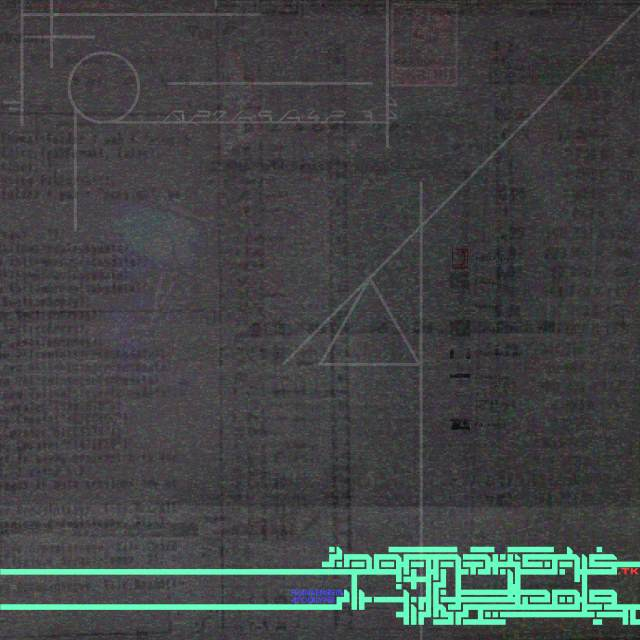
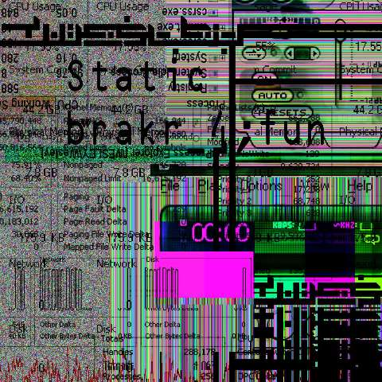
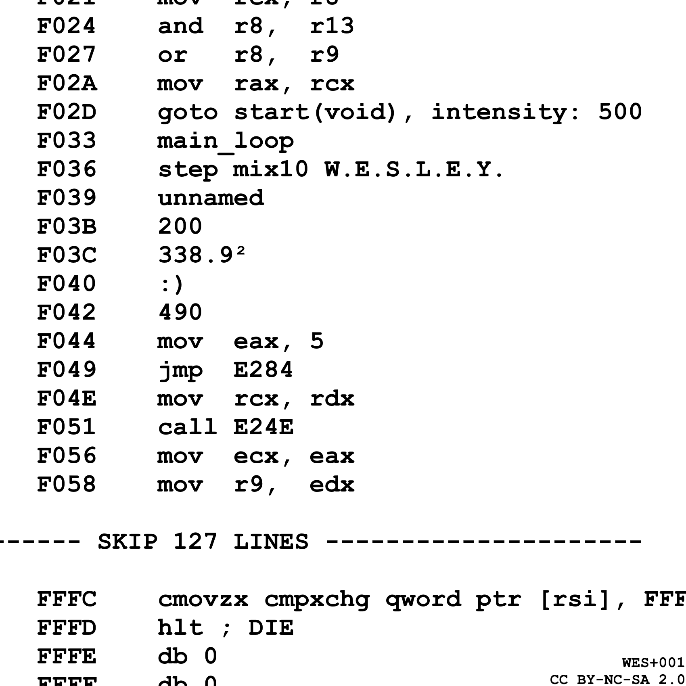
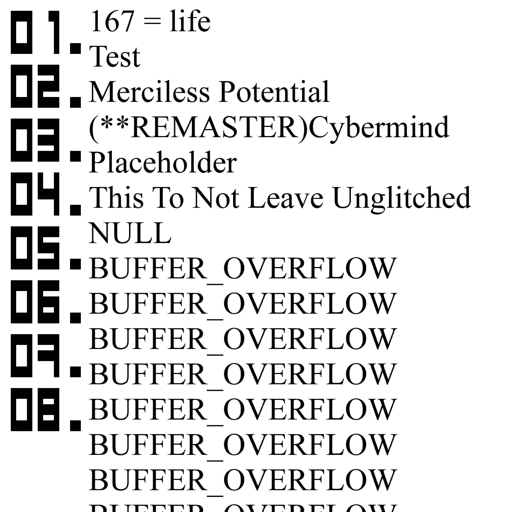

# `&__MUSIC_DEVELOPMENT`

## ALREADY RELEASED:

### ?__y5+souNdbug*swap.i684

 
Hardcore Electronic | Single | 2019 
Used OpenMPT | <a href="https://donnaken15.tk/sprug/sfx/?__y5+souNdbug*swap.i684/mp3">Play</a>

### Static brakr_4;fun

step mix10 W.E.S.L.E.Y. - [Play](https://www.youtube.com/watch?v=DQadWC0mC1c) -
<a href="staticbrakr4fun/step mix10 W.E.S.L.E.Y..s3m">Module</a> 
200 - [Play](https://www.youtube.com/watch?v=RJmD9VKGxAA) -
<a href="http://2a03.free.fr/dl.php?file=6159">Module</a>

## CURRENTLY WORKING ON:

### Static brakr_4;fun
 
Hardcore Electronic | 8 tracksEP | 2021 
Using OpenMPT, OctaMED, Famitracker 
FINISHED SONGS: step mix10 W.E.S.L.E.Y., 200

### Throwaway
 
Rock + Electronic + DnB | 7 tracksEP | 2021 
Using OpenMPT m